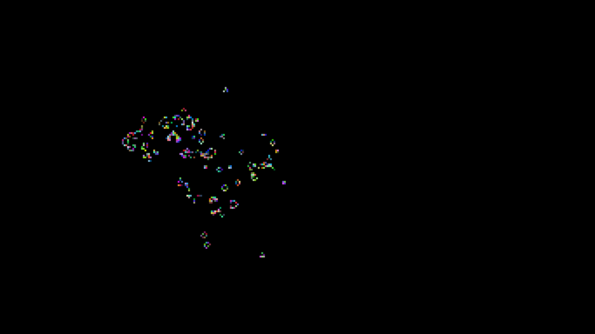

# Game Of Life

## Introduction

This is a remake of the **Game of Life**, a popular cellular automata, developed using [*Allegro*](https://liballeg.org/), a simple cross platform 2D graphic library, and MPI, a popular library used for parallel programming on memory distributed systems.



## Game rules
### *Source: Wikipedia*

The universe of the **Game of Life** is an infinite, two-dimensional orthogonal grid of square cells, each of which is in one of two possible states, alive or dead, (or populated and unpopulated, respectively). Every cell interacts with its eight neighbours, which are the cells that are horizontally, vertically, or diagonally adjacent. At each step in time, the following transitions occur:

- Any live cell with fewer than two live neighbours dies, as if by underpopulation.
- Any live cell with two or three live neighbours lives on to the next generation.
- Any live cell with more than three live neighbours dies, as if by overpopulation.
- Any dead cell with exactly three live neighbours becomes a live cell, as if by reproduction.

## Installation

Open your terminal in the project's root folder and execute this commands:

```
make
make clean
./gameoflife -np 2 (or number of cores that has your CPU)

```
### Enjoy it!

**Developed by Antonino Agostino (Zane)**
